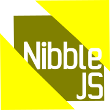
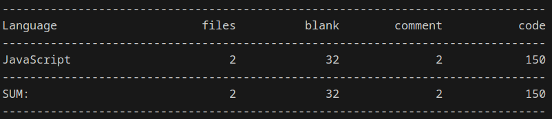

# nibble.js



[](https://linkedin.com/in/nabeelalihashmi)
[](https://aliveforms.com)

NibbleJS is a minimal lightweight and efficient JavaScript framework for reactive programming and data binding. It provides a minimalistic approach to manage reactivity with signals in your web applications. It is written in 150 lines of code only. It's API is extremly small, so learning curve is very small. Signal API is composed of 4 functions only: `signal`, `compute`, `watch`, `effect` and Nibble DOM has only following directives `bind:value|text|html|group|any attribute`, `class:`, `this`, `if` and `nibble`if you want to activate nibble dom only on selected nodes,




## Developer Information

- **Developer:** Nabeel Ali
- **Email:** mail2nabeelali@gmail.com
- **LinkedIn:** [https://linkedin.com/in/nabeelalihashmi](https://linkedin.com/in/nabeelalihashmi)
- **Twitter/X:** [https://twitter.com/nabeelalihashmi](https://twitter.com/nabeelalihashmi)
- **YouTube:** [https://youtube.com/@nabeelalihashmi](https://youtube.com/@nabeelalihashmi)
- **Website:** [aliveforms.com](https://aliveforms.com)


## Why NibbleJS?

NibbleJS is designed to remove the overhead of large frameworks while simplifying the development of web applications by offering a streamlined, easy-to-use reactive programming library. Here are some reasons why you might choose NibbleJS:

- **No Compilation Required:** NibbleJS works directly with the DOM. Just plug and play.
- **Decoupled Design:** You can use NibbleJS with signals for reactivity or add the DOM library for additional features.
- **Lightweight and Fast:** Optimized for performance, ensuring minimal overhead.
- **Flexible Data Binding:** Easily bind data to DOM elements and keep your UI in sync with your state.
- **Minimal Codebase:** At just 150 lines of code, NibbleJS provides a compact alternative to larger frameworks like Vue and Svelte, reducing complexity while maintaining functionality.
- **Avoid Overhead:** Designed to avoid the overhead of larger frameworks, making it easier to integrate with other platforms.
- **Easy Integration:** Can be seamlessly used with PHP frameworks like Laravel to add interactivity without the need for heavy dependencies.

With NibbleJS, you can achieve efficient reactivity and data binding in your web applications without the bloat of larger frameworks.

## Features

## Features of NibbleJS

- **Reactive Programming:** Manage reactivity efficiently with a simple signal system.
- **Flexible Data Binding:**
  - **Two-Way Binding:** Use `bind:value` for two-way data binding between DOM elements and application state.
  - **Property Binding:** Bind attributes to elements with `bind:`, enabling dynamic property updates.
  - **Group Binding:** Handle radio and checkbox groups efficiently with group binding functionality with `bind:group`.
- **Conditional Rendering:** Use `if` for conditional rendering of DOM elements based on your application's state.
- **Class Binding:** Dynamically add or remove CSS classes with `class:` for better styling control.
- **Watcher:** Utilize watchers to react to changes in state and perform actions accordingly.
- **Minimal Overhead:** Avoids the complexity and bloat of larger frameworks, making integration with other platforms seamless.
- **Easy Integration:** Can be easily integrated with PHP frameworks like Laravel to add interactivity to your applications.
- **Dynamic Updates:** Supports real-time updates and efficient DOM manipulation.
- **Simple API:** Provides a straightforward API for managing signals, effects, and reactivity.
- **No Dependencies:** Operates independently of other libraries, reducing potential conflicts and bloat.
- **Cross-Browser Compatibility:** Works across various browsers to ensure consistent functionality.


## Installation and Usage

Download the files and link using script
```
<script src="signal.js">
<script src="dom.js">
```

Via CDN links, making it easy to include in your project:

```
<script src="https://cdn.jsdelivr.net/gh/nabeelalihashmi/nibble@main/js/v1/signal.js"></script>
<script src="https://cdn.jsdelivr.net/gh/nabeelalihashmi/nibble@main/js/v1/dom.js"></script>
```

## Signal API Documentation

### signal

Creates a reactive signal.

```
const count = signal(0);
```

### effect

Runs a function whenever its dependent signals change.

```
effect(() => {
    console.log(count.value);
});
```

### compute

Creates a computed signal based on other signals.

```
const doubleCount = compute(() => count.value * 2);
```

### watch

Watches for changes in a signal and runs a callback with the old and new values.

```
watch(count, (newValue, oldValue) => {
    console.log(`Count changed from ${oldValue} to ${newValue}`);
});
```

## Nibble DOM Documentation


NibbleJS supports various bindings and directives to synchronize the DOM with your application state. When using NibbleJS DOM functionality, make sure to declare signals with `var`. call `nibbleDom` to initialize. 

### nibbleDom

Initializes NibbleJS bindings in the DOM.

```
document.addEventListener("DOMContentLoaded", () => {
    nibbleDom();
});
```

### bind:value

Binds the value of an input element to a signal.

```
<input type="number" bind:value="count" />
```

### bind:text

Binds the inner text of an element to a signal.

```
<button bind:text="count">0</button>
```

### bind:html

Binds the inner HTML of an element to a signal.

```
<div bind:html="doubleCount">0</div>
```


### bind:property

Binds the property of an element to a signal.

```
<div bind:src="imgLink">0</div>
```

```
<button this="dis" bind:disabled="disable">Disable</button>

// after nibble dom is initialized
 dis.addEventListener('click', function () {
    disable.value = "disable";
})

```


### bind:group

Binds a group of checkboxes or radio buttons to a signal.

#### Checkbox Group

```
<input type="checkbox" name="fruits" value="apple" bind:group="selectedFruits" />
<input type="checkbox" name="fruits" value="banana" bind:group="selectedFruits" />
<input type="checkbox" name="fruits" value="mango" bind:group="selectedFruits" />
```

#### Radio Group

```
<input type="radio" name="agree" value="no" bind:group="agree" />
<input type="radio" name="agree" value="yes" bind:group="agree" />
```

### class:classname

Toggles a class on an element based on a signal's value.

```
<button class:bg-danger="isDanger">0</button>
```

### if

Conditionally displays an element based on a signal's value.

```
<div if="agreement">
    <h1>OOOPS!!!</h1>
</div>
```


### this

Binds reference of button without requiring querySelector or getElementById. Only usable after `nibbleDom()` is called, which is automatically called in dom.js. Make sure to put the code access reference after DOMContentLoaded.

```
<button bind:this="myButton">Set</button>

myButton.addEventListener('click', function() {
    name.value = 'Test'
})
```

### nibble

By default, Nibble DOM selects all nodes while applying. To optimize it, set `window.explicitNibble = true` before adding `dom.js` and in elements, add attribute `nibble`

## Examples

### Singls Only without Nibble DOM
```
<!DOCTYPE html>
<html lang="en">

<head>
    <meta charset="UTF-8">
    <meta name="viewport" content="width=device-width, initial-scale=1.0">
    <title>NibbleJS</title>
    <style>
        body {
            display: flex;
            justify-content: center;
            align-items: center;
            min-height: 100vh;
        }

        .main {
            padding: 1rem;
            border: 1px solid #FFBF00;
            border-radius: 1rem;
        }
    </style>

<link rel='stylesheet' href='https://cdnjs.cloudflare.com/ajax/libs/picocss/2.0.6/pico.amber.min.css' integrity='sha512-kvYLueAc7RD0XOfxhjiaUKbXBmh5JTZdyJo/12oY/zpT0l6o82H2Ap5f27CrAa16VgvXj02Rsb0Prwtq7oYOSw==' crossorigin='anonymous'/>
</head>

<body>

    <!-- Signals Only without Nibble DOM -->
    <div class="main border">
        <div>
            <h1>NibbleJS Signal</h1>
        </div>
        <div>
            <input type="number" id="number">
        </div>
        <p>
            Value: <span id="value"></span> <br>
            Computed: <span id="computed"></span>
        </p>
        <p>
            <button id="button">Reset</button>
        </p>
        <p>
            <small>
                Created by Nabeel Ali - <a href="https://linkedin.com/in/nabeelalihashmi">linkedin.com/in/nabeelalihashmi</a>
            </small>
        </p>
    </div>

    <!-- Nibble DOM -->

    <script src="./js/v1/signal.js"></script>
    <script src="./js/v1/dom.js"></script>

    <script>
        // Complete signal api has only following members 
        // signal, compute, effect, watch

        let count = signal(0);
        let computedValue = compute(() => count.value * 10);

        let input = document.querySelector("#number");
        let valueDiv = document.querySelector("#value");
        let computedDiv = document.querySelector("#computed");
        let resetButton = document.querySelector("#button");

        input.addEventListener('input', function (event) {
            count.value = event.target.value
        })

        resetButton.addEventListener('click', function () {
            count.value = 0;
        })

        effect(() => {
            valueDiv.innerText = count.value;
        })

        effect(() => {
            input.value = count.value;
        })


        effect(() => {
            computedDiv.innerText = computedValue.value;
        })

        watch(count, (newValue, oldValue) => {
            console.log(`count changed from ${oldValue} to ${newValue}`)
            if (newValue > 50) {
                alert("Above 50 not allowed");
                count.value = 50;
            }
        })
    </script>
</body>

</html>
```

### With Nibble DOM

```
<!DOCTYPE html>
<html lang="en">

<head>
    <meta charset="UTF-8">
    <meta name="viewport" content="width=device-width, initial-scale=1.0">
    <title>NibbleJS</title>
    <style>
        body {
            display: flex;
            justify-content: center;
            align-items: center;
            min-height: 100vh;
        }

        .main {
            padding: 1rem;
            border: 1px solid #FFBF00;
            border-radius: 1rem;
        }

        .danger {
            border: 2px solid #ff0000 !important;
        }
    </style>

    <link rel='stylesheet' href='https://cdnjs.cloudflare.com/ajax/libs/picocss/2.0.6/pico.amber.min.css'
        integrity='sha512-kvYLueAc7RD0XOfxhjiaUKbXBmh5JTZdyJo/12oY/zpT0l6o82H2Ap5f27CrAa16VgvXj02Rsb0Prwtq7oYOSw=='
        crossorigin='anonymous' />
</head>

<body>

    <!-- Signals Only with Nibble DOM -->
    <!-- bind:value|text|html|property, class:, this, if -->

    <div class="main border" class:danger="isDanger">
        <div>
            <h1>NibbleJS DOM</h1>
        </div>
        <div>
            <input type="number" bind:value="count">
        </div>
        <p>
            Value: <span bind:text="count"></span> <br>
            Computed: <span bind:text="computedValue"></span>
        </p>
        <p>
            <button this="button">Reset</button>
        </p>
       
        <p>
        <fieldset>
            <legend>Fruits</legend>
            <div>
                <ul bind:html="fruits" class="list-group"></ul>
            </div>
            <div>
                <input type="checkbox" id="apple" name="fruit[]" value="apple" bind:group="selectedFruits" />
                <label for="apple">Apple</label>
            </div>
            <div>
                <input type="checkbox" id="banana" name="fruit[]" value="banana" bind:group="selectedFruits" />
                <label for="banana">Banana</label>
            </div>
            <div>
                <input type="checkbox" id="mango" name="fruit[]" value="mango" bind:group="selectedFruits" />
                <label for="mango">Mango</label>
            </div>
        </fieldset>
        </p>

        <p>
        <fieldset>
            <legend>Agree</legend>
            <div if="agreement" class:danger="isDanger">
                <h3>Conditional Agree</h3>
            </div>
    
            <div class="form-check">
                <input type="radio" id="agree-no" name="agree" value="no" bind:group="agree" />
                <label for="agree-no">No</label>
            </div>
            <div>
                <input type="radio" id="agree-yes" name="agree" value="yes" bind:group="agree"
                 />
                <label for="agree-yes">Yes</label>
            </div>
        </fieldset>
        </p>

        <p>
            <small>
                Created by Nabeel Ali - <a href="https://linkedin.com/in/nabeelalihashmi">linkedin.com/in/nabeelalihashmi</a>
            </small>
        </p>
    </div>

    <!-- Nibble DOM -->

    <script src="./js/v1/signal.js"></script>
    <script src="./js/v1/dom.js"></script>

    <script>
        // Complete Nibble DOM api has only following directives 

        // with dom, signal must use var
        var count = signal(0);
        var computedValue = compute(() => count.value * 10);

        var selectedFruits = signal(["mango"]);
        var fruits = compute(() =>
            selectedFruits.value.map((f) => `<li class="list-group-item">${f}</li>`).join(""),
        );

        var agree = signal("yes");
        var agreement = compute(() =>
            agree.value == "yes" ? true : false,
        );

        var isDanger = compute(() => count.value > 30 ? true : false);
        var showItem = compute(() => count.value > 30 ? true : false);

        document.addEventListener('DOMContentLoaded', app);
        function app() {

            console.log('loaded')
            button.addEventListener('click', function () {
                count.value = 0;
            })

            // make sure it runs after DOMContentLoaded
            watch(count, (oldValue, newValue) => {
                console.log(`count changed from ${oldValue} to ${newValue}`)
                if (newValue > 50) {
                    alert("Above 50 not allowed");
                    count.value = 50;
                }
            })

        }
    </script>
</body>

</html>
```

## Feedback

I value your feedback! Please share your thoughts, suggestions, and experiences with NibbleJS. Your input helps to improve and tailor the framework to better meet your needs.

